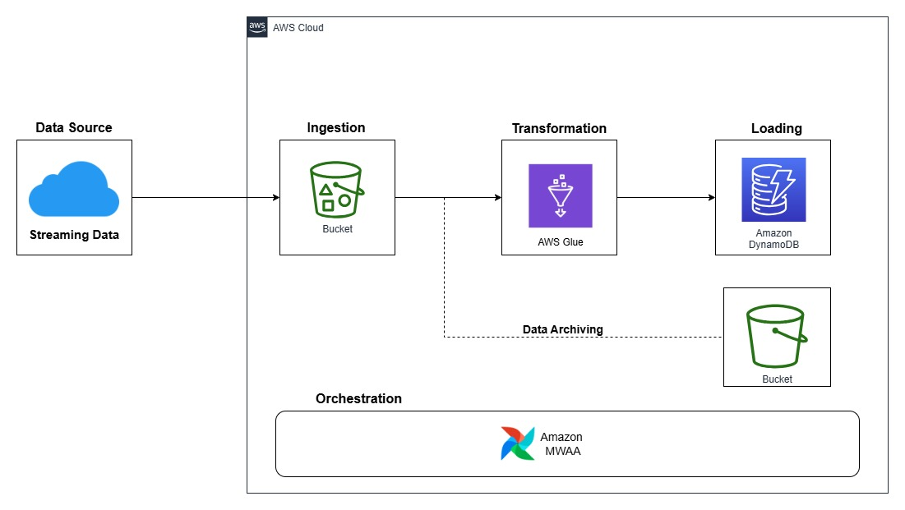

Overview
========

# Data Pipeline with Airflow & AWS GLUE

This project demonstrates how to use Apache Airflow to orchestrate an ETL pipeline that extracts data from an S3 bucket, transforms it, and loads it into a DynamoDB table. This project fetches batch data containing user and song metadata that reside in an Amazon RDS database and streaming data stored in Amazon S3 in batch files. This pipeline extracts, validates, transforms, and loads the data into Amazon DynamoDB for fast analytical processing and real-time business intelligence consumption.

    

Technologies Used
==================
 - Apache Airflow (ETL orchestration)
 - AWS Glue (PySpark, Python Shell) (Data transformation)
 - Amazon S3 (Raw data storage)
 - Amazon DynamoDB (Processed data storage)
 - Python, Pandas, PySpark (Data processing)

## KPIs Computed
- Listen Count: Total number of streams per genre per day.
- Unique Listeners: Count of distinct users per genre per day.
- Total Listening Time: Aggregate listening duration per genre per day.
- Average Listening Time per User: Mean listening time per user per day.
- Top 3 Songs per Genre per Day: Most played tracks in each genre daily.
- Top 5 Genres per Day: Most popular genres based on listen count.

## Architecture & Data Flow
1. Data Source:
    - Streaming data is ingested as batch files in Amazon S3 at irregular intervals.
2. Processing:
    - Validation: Ensure files have the required schema before processing.
    - Transformation: Clean and normalize data using AWS Glue (PySpark & Python Shell jobs).
    - Metric Computation: Compute key KPIs for real-time insights.
3. Storage & Consumption:
    - Processed data is stored in Amazon DynamoDB for fast lookups by downstream applications.

Key Features
============
 1. Real-Time Processing: Handles data as it arrives without batch scheduling.
 2. Scalable & Cloud-Native: Leverages AWS Glue, S3, DynamoDB, and Airflow for orchestration.
 3. Automated Workflow: Orchestrated with Apache Airflow, ensuring smooth execution and monitoring.
 4. Failure Handling: Sends email alerts if the pipeline fails.

Project Contents
================

Your Astro project contains the following files and folders:

- dags: This folder contains the Python files for your Airflow DAGs. By default, this directory includes one example DAG:
    - `example_astronauts`: This DAG shows a simple ETL pipeline example that queries the list of astronauts currently in space from the Open Notify API and prints a statement for each astronaut. The DAG uses the TaskFlow API to define tasks in Python, and dynamic task mapping to dynamically print a statement for each astronaut. For more on how this DAG works, see our [Getting started tutorial](https://www.astronomer.io/docs/learn/get-started-with-airflow).
    - `dag_v1` : 
- Dockerfile: This file contains a versioned Astro Runtime Docker image that provides a differentiated Airflow experience. If you want to execute other commands or overrides at runtime, specify them here.
- include: This folder contains any additional files that you want to include as part of your project. It is empty by default.
- packages.txt: Install OS-level packages needed for your project by adding them to this file. It is empty by default.
- requirements.txt: Install Python packages needed for your project by adding them to this file. It is empty by default.
- plugins: Add custom or community plugins for your project to this file. It is empty by default.
- notebooks: wertyuiop
    - `eda.ipynb`:
- airflow_settings.yaml: Use this local-only file to specify Airflow Connections, Variables, and Pools instead of entering them in the Airflow UI as you develop DAGs in this project.

Deploy Your Project Locally
===========================

1. Start Airflow on your local machine by running 'astro dev start'.

This command will spin up 4 Docker containers on your machine, each for a different Airflow component:

- Postgres: Airflow's Metadata Database
- Webserver: The Airflow component responsible for rendering the Airflow UI
- Scheduler: The Airflow component responsible for monitoring and triggering tasks
- Triggerer: The Airflow component responsible for triggering deferred tasks

2. Verify that all 4 Docker containers were created by running 'docker ps'.

Note: Running 'astro dev start' will start your project with the Airflow Webserver exposed at port 8080 and Postgres exposed at port 5432. If you already have either of those ports allocated, you can either [stop your existing Docker containers or change the port](https://www.astronomer.io/docs/astro/cli/troubleshoot-locally#ports-are-not-available-for-my-local-airflow-webserver).

3. Access the Airflow UI for your local Airflow project. To do so, go to http://localhost:8080/ and log in with 'admin' for both your Username and Password.

You should also be able to access your Postgres Database at 'localhost:5432/postgres'.

Deploy Your Project to Astronomer
=================================

If you have an Astronomer account, pushing code to a Deployment on Astronomer is simple. For deploying instructions, refer to Astronomer documentation: https://www.astronomer.io/docs/astro/deploy-code/

Contact
=======

The Astronomer CLI is maintained with love by the Astronomer team. To report a bug or suggest a change, reach out to our support.
